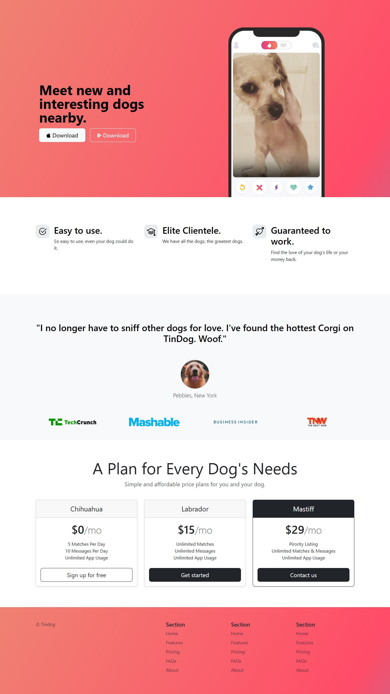

# tindog-landing-page
# 🐶 TinDog – Dog Dating Landing Page

This is a responsive landing page for a dog dating application called **TinDog**, built using **HTML** and **Bootstrap 5**.

## 🎯 What it includes
- Hero section with call-to-action buttons
- Responsive Bootstrap grid layout
- Features section with icons
- Testimonial section with user feedback
- Pricing plans using Bootstrap cards
- Footer with navigation links
- Fully responsive design for all devices

## 🛠️ Technologies Used
- HTML5
- CSS3
- Bootstrap 5 (Grid & Components)
- Bootstrap Icons (SVG)

## 🎓 Learning Purpose
This project was created as a **self-training project to practice Bootstrap** layout, components, and responsive design principles.

## ▶️ How to run
Just open the `index.html` file in any modern browser — the website will display.

## 📷 Preview

  

Made as a beginner-friendly Bootstrap project 🚀
